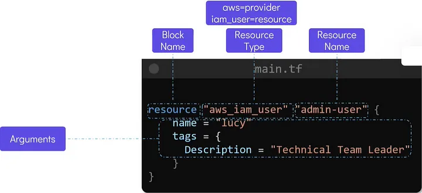

<h2> Terraform Basic to Pro </h2>

- [Challenges with Traditional IT Infrastructure](#challenges-with-traditional-it-infrastructure)
- [What is Infrastracture as Code (IaC) \& Types of IAC](#what-is-infrastracture-as-code-iac--types-of-iac)
- [How Terraform Helps Mitigate These Challenges](#how-terraform-helps-mitigate-these-challenges)
- [Why Terraform?](#why-terraform)
- [Installing Terraform](#installing-terraform)
- [HashiCorp Configuration Language (HCL) Basics](#hashicorp-configuration-language-hcl-basics)
- [Terraform and HashiCorp Configuration Language (HCL) Basics](#terraform-and-hashicorp-configuration-language-hcl-basics)
  - [Terraform Commands and Examples](#terraform-commands-and-examples)
  - [Examples of Terraform Commands](#examples-of-terraform-commands)
  - [3. Variables](#3-variables)
  - [4. Resource Attributes](#4-resource-attributes)
  - [5. Resource dependencies](#5-resource-dependencies)
  - [6. Output Variables](#6-output-variables)
- [What is Terraform State](#what-is-terraform-state)
- [Purpose Terraform State](#purpose-terraform-state)
  - [Mutable vs Immutable Infrastructure](#mutable-vs-immutable-infrastructure)
    - [Mutable Infrastructure](#mutable-infrastructure)
    - [Immutable Infrastructure](#immutable-infrastructure)
    - [Use Cases:](#use-cases)
  - [LifeCycle Rules](#lifecycle-rules)
  - [Datasource](#datasource)


# Challenges with Traditional IT Infrastructure

Traditional IT infrastructure management often faces several challenges:

1. **Manual Configuration and Provisioning:**
   - Setting up and configuring servers, networks, and storage devices manually can be time-consuming and error-prone.
   
2. **Configuration Drift:**
   - Over time, discrepancies can arise between the intended configuration and the actual state of deployed infrastructure due to manual changes or updates.
   
3. **Scalability Issues:**
   - Scaling infrastructure resources up or down manually may lead to inefficiencies or delays in response to changing demand.
   
4. **Lack of Consistency:**
   - Inconsistent configurations across different environments (development, testing, production) can lead to deployment issues and errors.

5. **Limited Automation:**
   - Traditional infrastructure management often lacks comprehensive automation for provisioning, configuration, and deployment processes.

6. **Challenges in Hardware Procurement:**
   - Procuring hardware involves long lead times, substantial upfront costs, and the risk of investing in soon-to-be obsolete technology. Managing multiple vendors and predicting future hardware needs accurately add complexity and potential delays.

# What is Infrastracture as Code (IaC) & Types of IAC


Here's a structured view of IaC tools categorized into three primary types: 
1. Server Configuration Management
2. Templating Tools
3. Provisioning Tools
   
Infrastructure as Code (IaC) tools automate the provisioning, configuration, and management of infrastructure resources through code. Here are some popular types of IaC tools:

1. **Declarative IaC Tools:**
   - **Terraform:** A versatile tool by HashiCorp that allows infrastructure to be defined using a declarative configuration language (HCL). It supports multiple cloud providers and on-premises environments, enabling consistent provisioning and management of infrastructure.

2. **Imperative IaC Tools:**
   - **AWS CloudFormation:** Amazon Web Services' native IaC tool that uses JSON or YAML templates to define AWS resources and their dependencies. It follows an imperative approach where users specify the exact steps needed to achieve the desired state.

3. **Configuration Management Tools:**
   - **Ansible:** Although primarily a configuration management tool, Ansible also supports IaC through its Ansible Playbooks. It uses YAML-based declarative language to define configurations and automate infrastructure tasks across servers and cloud environments.

4. **Hybrid Tools:**
   - **Pulumi:** Combines IaC with programming languages like Python, JavaScript, or TypeScript. It allows developers to use familiar programming constructs to define and manage cloud infrastructure resources, providing flexibility and extensibility.

5. **Specialized Tools:**
   - **Chef:** Known for its configuration management capabilities, Chef also offers Chef Infra as an IaC tool. It uses Ruby-based scripts (cookbooks) to define infrastructure configurations.
   - **SaltStack (Salt):** Another configuration management tool that supports IaC through Salt states. It uses YAML or Jinja-based files to define infrastructure configurations and manage complex deployments.

Each type of IaC tool offers unique advantages and capabilities suited to different infrastructure management needs, ranging from cloud provisioning and configuration management to container orchestration and hybrid cloud environments. Choosing the right tool depends on factors such as the complexity of the infrastructure, team expertise, desired level of automation, and integration with existing workflows and tools.


# How Terraform Helps Mitigate These Challenges

[Terraform](https://www.terraform.io/) is a widely used Infrastructure as Code (IaC) tool that helps address many of the challenges associated with traditional IT infrastructure management:

1. **Infrastructure as Code (IaC):**
   - **Terraform allows infrastructure to be defined and managed as code** using a declarative configuration language (HCL - HashiCorp Configuration Language). This eliminates manual configuration and enables consistent provisioning of infrastructure resources.

2. **Automation and Orchestration:**
   - Terraform automates the provisioning and lifecycle management of infrastructure resources across various cloud providers and on-premises environments. It manages dependencies and orchestrates the deployment process, ensuring reliability and consistency.

3. **State Management:**
   - Terraform maintains a state file that tracks the current state of deployed infrastructure. This helps prevent configuration drift by accurately reflecting the desired infrastructure state defined in the Terraform configuration files.

4. **Scalability and Flexibility:**
   - With Terraform, infrastructure can be scaled dynamically based on demand by defining resource configurations and using variables and expressions to parameterize deployments. This ensures efficient resource allocation and management.

5. **Ecosystem and Integrations:**
   - Terraform has a rich ecosystem of providers and modules that facilitate integration with various services and platforms. This allows organizations to leverage existing configurations and automate complex workflows easily.

6. **Cost Efficiency and Risk Mitigation:**
   - By provisioning infrastructure through Terraform, organizations can reduce reliance on traditional hardware procurement models. They can leverage cloud services and hybrid solutions provisioned via Terraform to optimize resource usage, minimize upfront costs, and mitigate risks associated with hardware obsolescence and vendor management.

7. **Version Control and Collaboration:**
   - Terraform configurations can be version-controlled using Git or other version control systems. This enables teams to collaborate effectively, track changes, and implement best practices for infrastructure management.


<p align="center">
  
  <br/>
  Pic: How Terraform Helps Mitigate These Challenges
</p>


# Why Terraform?

Terraform is a highly popular Infrastructure as Code (IaC) tool due to its flexibility, cloud-agnostic nature, and powerful features that make it suitable for managing modern infrastructure. 


# Installing Terraform

[Here](https://developer.hashicorp.com/terraform/tutorials/aws-get-started/install-cli) simple Terraform Installation Steps


# HashiCorp Configuration Language (HCL) Basics

1. **Purpose and Syntax:**
   - **Purpose:** HCL is designed specifically for configuring infrastructure and services in HashiCorp tools like Terraform, Vault, Consul, and others.
   - **Syntax:** HCL uses a simple and human-readable syntax based on key-value pairs, blocks, and expressions.
  
2.  **Blocks and Arguments**
   - Terraform and other HashiCorp tools, consist of blocks and arguments as their primary structural components.
    **Blocks**
    - Definition: A block is a structural element in HCL that defines a resource, module, or configuration. Blocks group related settings or operations.
    ```bash
    block_type "label" "optional_label" {
    argument_name = value
    }
    ```
    **Components:**
    - Block Type: The type of the block (e.g., resource, provider, module).
    - Labels: Unique identifiers for the block, such as the name or type of the resource.
    - Body: The contents inside {}, which often consist of arguments or nested blocks.
    ```bash
    resource "aws_instance" "example" {
      ami           = "ami-123456"
      instance_type = "t2.micro"
    }
    ```
    
    **Arguments**
    - Definition: Arguments define key-value pairs inside blocks. They configure specific properties or settings for the block.
    ```bash
    provider "aws" {
      region  = "us-west-2"
      profile = "my-profile"
    }
    ```
    **provider** Block:

    - What it is: Specifies the provider Terraform will use. Here, the **aws** provider enables Terraform to manage AWS resources.
    - Why it's necessary: Terraform requires a provider configuration to communicate with the target infrastructure.
  
    Arguments within the Block:

    **region** Argument
    - What it is: Specifies the AWS region where Terraform will create and manage resources.
    - Value: "us-west-2" is the Oregon region of AWS.

3. **Variables:**
   - **Declaration:** Variables in HCL are declared using the `variable` keyword.
   - **Usage:** Variables allow you to parameterize your configurations, making them reusable and configurable.
   - **Example:**
     ```hcl
     variable "region" {
       type    = string
       default = "us-west-2"
     }
     ```

2. **Blocks:**
   - **Definition:** Blocks are used to define resources or configuration objects.
   - **Syntax:** Blocks start with a block type followed by curly braces `{}` containing configuration settings.
   - **Example:**
     ```hcl
     resource "aws_instance" "example" {
       ami           = "ami-0c55b159cbfafe1f0"
       instance_type = "t2.micro"
     }
     ```

3. **Expressions:**
   - **Interpolation:** HCL supports interpolation using `${}` to dynamically insert values into strings.
   - **Functions:** HCL includes built-in functions for data manipulation and calculations within configurations.
   - **Example:**
     ```hcl
     resource "aws_instance" "example" {
       ami           = "ami-${var.ami_id}"
       instance_type = "t2.micro"
     }
     ```

4. **Comments:**
   - **Single-line:** Comments start with `#`.
   - **Multi-line:** Enclosed between `/* */`.
   - **Example:**
     ```hcl
     # This is a single-line comment
     /*
       This is
       a multi-line
       comment
     */
     ```
5. **Types:**
   - HCL supports various types including string, number, boolean, list, and map types.
   - Type constraints can be specified for variables to enforce data validation.

6. **Modules:**
   - **Definition:** Modules in HCL allow you to encapsulate and reuse configurations.
   - **Usage:** They promote reusability, modularization, and abstraction of configuration logic across projects.
   - **Example:**
     ```hcl
     module "vpc" {
       source = "./modules/vpc"
       region = var.region
     }
     ```

7.  **Providers:**
   - **Definition:** Providers configure and expose resources within Terraform.
   - **Configuration:** They are defined with `provider "name" {}` and configured with settings like access keys, endpoints, etc.
   - **Example:**
     ```hcl
     provider "aws" {
       region = "us-west-2"
     }
     ```

8.  **Conditional Logic:**
   - **Usage:** HCL supports conditional logic using `if`, `else`, and `for` expressions.
   - **Example:**
     ```hcl
     resource "aws_instance" "example" {
       count = var.create_instances ? 2 : 0
       ami           = "ami-0c55b159cbfafe1f0"
       instance_type = "t2.micro"
     }
     ```

9.  **Output Values:**
    - **Definition:** Outputs in HCL define values that are displayed after applying configurations.
    - **Usage:** Useful for displaying resource IDs, IP addresses, or other information.
    - **Example:**
      ```hcl
      output "instance_id" {
        value = aws_instance.example.id
      }
      ```
Basic format of the terraform configuration file main.tf looks like this.
<p align="center">
  
  <br/>
  Pic: Basic format of the terraform configuration file 
</p>


Summary:

HashiCorp Configuration Language (HCL) is integral to defining infrastructure as code (IaC) in tools like Terraform, providing a clear and concise syntax for configuring resources across various cloud and on-premises platforms. Understanding these basics allows you to effectively manage and automate infrastructure deployments using HCL-based configurations.

[Provider References](https://registry.terraform.io/browse/providers)


# Terraform and HashiCorp Configuration Language (HCL) Basics

## Terraform Commands and Examples

1. Initialize a Terraform working directory.
`terraform init`
2. Validate Terraform configuration files for syntax errors.
`terraform validate`
3. Format Terraform configuration files.
`terraform fmt`
4. Show Terraform state or resource state.
`terraform show`
5. Show specific resource state (JSON format).
`terraform show -json`
6. Show providers required for the current configuration
`terraform providers`
7. Refresh the state of managed resources against real infrastructure.
`terraform refresh`
8. Generate a dependency graph of Terraform resources (in DOT format).
```
sudo apt install graphviz -y
terraform graph | dot -Tsvg > graph.svg
```
9. Generate an execution plan for changes to be applied.
`terraform plan`
10. Apply the changes required to reach the desired state of the configuration.
`terraform apply`
11. Destroy Terraform-managed infrastructure.
`terraform destroy`
12. Pull the current state and output to stdout.
`terraform state pull`

## Examples of Terraform Commands

0. **provider**
   - In Terraform, a provider is a plugin that allows Terraform to interact with different APIs and services. Providers are responsible for understanding the API of the resource they manage and how to create, read, update, and delete (CRUD) resources in that system. 
   - Essentially, a provider is a bridge between Terraform and external services like AWS, Google Cloud, Azure, Kubernetes, etc.
  
1. **Initialize (`terraform init`):**
   `terraform init`
   - Purpose: Initializes the current directory as a Terraform working directory.
   - Output: Downloads necessary plugins (providers and modules) and initializes the backend.
  
2. **Write and Validate Configuration**

    `vim main.tf`

    ```hcl
    // main.tf
    provider "aws" {
    region = "us-west-2"
    }

    resource "aws_instance" "example" {
    ami           = "ami-0c55b159cbfafe1f0"
    instance_type = "t2.micro"
    }
    ```
   - Purpose: Defines an AWS provider and an EC2 instance resource in Terraform configuration (main.tf).
   - Action: Ensure the syntax and configuration are correct before proceeding to terraform plan or terraform apply.
  
3. Plan (terraform plan):
`terraform plan`
   - Purpose: Generates an execution plan based on the current configuration.
   - Output: Displays proposed changes (additions, modifications, deletions) without actually applying them.
1. Apply Changes (terraform apply):
`terraform apply`
   - Purpose: Applies the changes defined in the Terraform configuration to reach the desired state.
   - Action: Prompts for confirmation before executing operations like creating, modifying, or deleting resources.
1. Validate (terraform validate):
`terraform validate`

   - Purpose: Validates the syntax and configuration of Terraform files.
   - Output: Checks for any errors in the configuration files (*.tf) before planning or applying changes.
1. Refresh (terraform refresh):
`terraform refresh`
   - Purpose: Updates the Terraform state file (terraform.tfstate) with the current real-world infrastructure configuration.
   - Action: Useful when the state file needs to be synchronized due to changes made outside of Terraform.
  `terraform plan --refresh=false`
   - Disable the refreshing of the state when generating a plan. 
   - By default, when you run terraform plan, Terraform will refresh the state of the infrastructure, which means it will compare the existing resources in your cloud provider or infrastructure platform with the state file to ensure it is up to date.
1. Destroy (terraform destroy):
`terraform destroy`
   - Purpose: Destroys all resources managed by Terraform for a given configuration.
   - Action: Safely decommissions and deletes resources provisioned by Terraform.

## 3. Variables 
Using variables in Terraform allows you to parameterize your configurations and make them more flexible and reusable. Variables can be defined and used throughout your Terraform configuration files to customize resource settings, inputs, and outputs. 

**Ways to Declare Variables in Terraform:**
1. Inline Variable Declaration: Variables can be defined directly within the Terraform configuration files using the variable block.

```hcl
variable "region" {
  description = "AWS region where resources will be provisioned"
  default     = "us-east-1"
}
```
2. Variable Definitions File (terraform.tfvars): You can create a file named terraform.tfvars (or any file ending in .auto.tfvars) to define variables. Terraform automatically loads values from this file if it exists in the current directory.

`region = "us-east-1"`

3. Environment Variables: Terraform automatically reads environment variables prefixed with TF_VAR_ to set variable values.
   
`export TF_VAR_region="us-east-1"`

4. Command-Line Flags: You can set variables directly from the command line using the -var option when running terraform plan or terraform apply.

`terraform plan -var="region=us-east-1"`

5. Variable Files (*.tfvars): You can create separate .tfvars files and specify them using -var-file option during terraform plan or terraform apply.

`terraform plan -var-file="variables.tfvars"`


## 4. Resource Attributes
Resource Attributes typically refer to the properties or characteristics of a resource that can be referenced or used within other parts of the configuration. These attributes are usually accessed using interpolation syntax ${}.

## 5. Resource dependencies

In Terraform, resource dependencies define the order in which resources are created, updated, or deleted. Dependencies ensure that Terraform provisions resources in the correct sequence based on relationships defined between them. There are primarily two types of dependencies: implicit and explicit dependencies.

1. Implicit Dependencies
Implicit dependencies are automatically inferred by Terraform based on the resource attributes referenced in the configuration. Terraform uses these references to establish the order of operations during the apply phase.

```hcl
# Define a VPC
resource "aws_vpc" "example_vpc" {
  cidr_block       = "10.0.0.0/16"
  instance_tenancy = "default"

  tags = {
    Name = "ExampleVPC"
  }
}

# Define a subnet within the VPC
resource "aws_subnet" "example_subnet" {
  vpc_id            = aws_vpc.example_vpc.id  # Implicit dependency on aws_vpc.example_vpc
  cidr_block        = "10.0.1.0/24"
  availability_zone = "us-west-2a"

  tags = {
    Name = "ExampleSubnet"
  }
}
```
Explanation:

- In the example above, aws_subnet.example_subnet implicitly depends on aws_vpc.example_vpc. This is because the vpc_id attribute of aws_subnet.example_subnet references aws_vpc.example_vpc.id.

- During the apply phase, Terraform recognizes that the subnet cannot be created until the VPC exists. Therefore, it creates the VPC first and then proceeds to create the subnet within that VPC

2.  Explicit Dependencies
Explicit dependencies are specified using the depends_on meta-argument within a resource block. This allows you to explicitly declare dependencies between resources that Terraform cannot infer automatically.

```hcl
# Define the AWS provider
provider "aws" {
  region = "us-east-1"
}

# Create a VPC
resource "aws_vpc" "example_vpc" {
  cidr_block       = "10.0.0.0/16"
  instance_tenancy = "default"

  tags = {
    Name = "ExampleVPC"
  }
}

# Create an EC2 instance that depends on the VPC
resource "aws_instance" "example_instance" {
  ami           = "ami-12345678"
  instance_type = "t2.micro"
  subnet_id     = aws_subnet.example_subnet.id  # Implicit dependency on subnet

  tags = {
    Name = "ExampleInstance"
  }

  depends_on = [aws_vpc.example_vpc]  # Explicit dependency on VPC
}

# Create a subnet within the VPC
resource "aws_subnet" "example_subnet" {
  vpc_id            = aws_vpc.example_vpc.id
  cidr_block        = "10.0.1.0/24"
  availability_zone = "us-east-1a"

  tags = {
    Name = "ExampleSubnet"
  }
}

```
Explainations:
- depends_on: The depends_on argument is used explicitly on the aws_instance.example_instance resource to denote that it should wait for the creation of aws_vpc.example_vpc before proceeding. This ensures that the VPC is fully created before attempting to create the instance.

## 6. Output Variables
Output variables in Terraform allow you to expose certain values from your infrastructure deployment that you may need to reference or use in other configurations or scripts. Here's how you can define and use output variables in Terraform.

# What is Terraform State

The Terraform state file `terraform.tfstate` is a critical component of Terraform's infrastructure management. It is a JSON file that stores information about the resources Terraform manages and tracks the current state of the infrastructure. Terraform uses this file to map your configuration to real-world resources and to determine what changes need to be made when applying your configurations.

# Purpose Terraform State

Terraform state is a fundamental aspect of managing infrastructure with Terraform, an infrastructure-as-code tool. It represents the current state of your infrastructure as tracked by Terraform itself. Here are key points about Terraform state:

- **Tracking Resources**: Terraform state keeps track of the resources declared in your Terraform configuration files (`*.tf` files) and the relationships between them.

- **Synchronization**: When you run `terraform apply`, Terraform compares the current state with the desired state defined in your configuration files to determine necessary changes.

- **Storage**: By default, Terraform stores state in a file named `terraform.tfstate`, but it can also be stored remotely in backends like Amazon S3, Azure Blob Storage, or HashiCorp Consul.

- **Concurrency**: Managing state is crucial in team environments to prevent conflicts when multiple team members work on the same infrastructure. Terraform provides mechanisms to lock the state file (`terraform state lock`).

- **Sensitive Data**: Terraform state may contain sensitive information (e.g., passwords, private IP addresses). It should be managed securely with encryption and access controls, especially when stored remotely.

- **State Commands**: Terraform provides commands (`terraform state`) to inspect, modify, and manage the state directly when necessary, although direct modifications should be handled carefully to avoid inconsistencies.


## Mutable vs Immutable Infrastructure

**Key Differences Between Mutable and Immutable Infrastructure**

### Mutable Infrastructure

- Terraform's behavior is to update the existing resources (without destroying them).
- If an attribute (like instance_type) is changed in the configuration, Terraform will modify the existing instance to match the updated configuration in-place (i.e., without deleting and recreating the resource).

**Mutable Infrastructure Example:**
In mutable infrastructure, existing resources are modified in place without being destroyed. Here's a simple mutable example:

**Example: Mutable Update of aws_instance**

```hcl
# main.tf
resource "aws_instance" "example_instance" {
  ami           = "ami-12345678"       # Initial AMI
  instance_type = "t2.micro"           # Initial instance type
  tags = {
    Name = "ExampleInstance"
  }
}

# Later in the same configuration, we change the instance type:
resource "aws_instance" "example_instance" {
  ami           = "ami-12345678"       # Same AMI (no change)
  instance_type = "t2.medium"          # Changed instance type (mutable change)
  tags = {
    Name = "ExampleInstance"
  }
}
```
**What happens during terraform apply?**\
- When you change the instance_type (from t2.micro to t2.medium), Terraform will modify the existing EC2 instance in place (it will not destroy it).
- The instance remains with the same ID (i.e., it is not replaced, just modified).

**Terraform's Action:**
- Terraform Plan: It will show that the instance type is being updated (not replaced).
- Terraform Apply: The instance type will be changed to t2.medium without deleting and recreating the instance.

### Immutable Infrastructure

- In immutable infrastructure, Terraform will destroy the old resource and create a new one with the new configuration.
- Typically, this is done by creating a new resource (like a new EC2 instance) and optionally removing the old one after it's replaced.

```hcl
# main.tf
resource "aws_instance" "example_instance" {
  ami           = "ami-12345678"       # Initial AMI
  instance_type = "t2.micro"           # Initial instance type
  tags = {
    Name = "ExampleInstance"
  }
}

# In immutable infrastructure, when we want to update the instance, we create a new resource with different configurations:
resource "aws_instance" "example_instance_v2" {
  ami           = "ami-87654321"       # New AMI (updated version)
  instance_type = "t2.medium"          # Changed instance type (immutable change)
  tags = {
    Name = "ExampleInstance_v2"
  }
}
```
**What happens during terraform apply?**
- When you change the ami and instance_type, Terraform sees the change as a new resource.
- Terraform will destroy the old EC2 instance (with the previous configuration) and create a new instance with the updated configuration (ami-87654321 and t2.medium).
  
**Terraform's Action**
- Terraform Plan: It will show that the old instance is being destroyed and a new one is being created.
- Terraform Apply: The old instance is destroyed, and a new one with the updated configuration is created.

**Whether an attribute is mutable or immutable**

- ~ aws_instance.example: This means the instance will be updated in-place (mutable attribute).
- - aws_instance.example: This means the instance will be destroyed and replaced (immutable attribute).

### Use Cases:

- **Mutable Infrastructure:** Often used in traditional IT environments and where immediate flexibility in making changes is required.
- **Immutable Infrastructure:** Common in cloud-native and DevOps environments, where scalability, predictability, and automation are prioritized.

**Conclusion:**

Choosing between mutable and immutable infrastructure depends on factors like organizational goals, existing infrastructure, and the desired level of automation and consistency. Many modern applications and services are moving towards immutable infrastructure due to its benefits in scalability, reliability, and ease of management through automation.

## LifeCycle Rules

In Terraform, lifecycle rules are used to control certain behaviors of resources managed by Terraform during their lifecycle. These rules are typically defined within a resource block and specify actions such as when to create, update, delete, or prevent certain operations on a resource. Here's a detailed explanation of Terraform lifecycle rules:

**Example 1:** create_before_destroy
The create_before_destroy lifecycle rule ensures that Terraform creates a new resource before destroying the old one during an update that requires replacement.
```
resource "aws_instance" "example" {
  ami           = "ami-12345678"    # Initial AMI
  instance_type = "t2.micro"

  tags = {
    Name = "example-instance"
  }

  lifecycle {
    create_before_destroy = true
  }
}
```
**Example 2:** ignore_changes
The ignore_changes lifecycle rule allows you to specify attributes that Terraform should ignore when determining if a resource should be updated.
resource "aws_instance" "example" {
  ami           = "ami-12345678"
  instance_type = "t2.micro"

  tags = {
    Name = "example-instance"
  }

  lifecycle {
    ignore_changes = [
      tags.Name  # Ignore changes to the "Name" tag
    ]
  }
}
**Example 3:** prevent_destroy
The prevent_destroy lifecycle rule in Terraform is used to prevent a specific resource from being destroyed (deleted) by Terraform. This can be useful in scenarios where you want to protect critical resources from accidental deletion.
```
resource "aws_instance" "example" {
  ami           = "ami-12345678"
  instance_type = "t2.micro"

  tags = {
    Name = "example-instance"
  }

  lifecycle {
    prevent_destroy = true
  }
}
```
**Example 5:** pre_destroy
The pre_destroy lifecycle hook allows you to define actions that should be performed just before Terraform destroys a resource. This is useful for performing cleanup tasks or notifying external systems.
```
resource "aws_instance" "example" {
  ami           = "ami-12345678"
  instance_type = "t2.micro"

  lifecycle {
    pre_destroy {
      # Export instance logs to S3 bucket
      local-exec {
        command = "aws s3 cp /var/log/cloud-init.log s3://example-bucket/cloud-init.log"
      }
    }
  }
}
```


**Usage Notes:**

State Management: Terraform manages the state of resources, tracking their current configuration and status. Lifecycle rules help ensure that updates and deletions are managed in a controlled manner.

Dependencies: Consider dependencies between resources and ensure that lifecycle rules are applied consistently across related resources to maintain infrastructure integrity.

## Datasource
Data source is a way to fetch and use information that already exists outside of Terraform, such as existing cloud resources, APIs, or any other external data that you want to incorporate into your Terraform configuration. Data sources allow you to query and retrieve specific attributes or details about these external resources and use that information within your Terraform configuration.

How do you declare and use a data source in Terraform?\
Answer: To declare a data source in Terraform, you use the data block followed by the data source type and configuration. For example:
```
data "aws_vpc" "example" {
  id = "vpc-12345678"
}
```
To use this data source elsewhere in your configuration, you can reference it using interpolation syntax, like ${data.aws_vpc.example.id}.

What are some common use cases for Terraform data sources?\
Answer: Common use cases for Terraform data sources include fetching details about existing infrastructure, such as VPCs, subnets, security groups, or IAM roles. They can also be used to retrieve information needed for dynamic configurations, such as the latest AMI ID for an EC2 instance.

