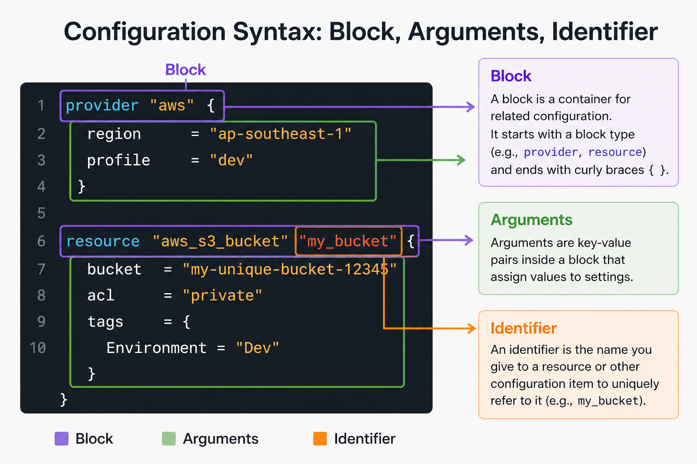

<h1 align="center">Terraform: Basic to Pro</h1>

A practical, end-to-end reference for learning Terraform — from first `terraform init` to advanced patterns like dynamic blocks, remote state, and module composition.

---

## Table of Contents

1. [Why Terraform?](#1-why-terraform)
2. [Installing Terraform](#2-installing-terraform)
3. [HCL Syntax Basics](#3-hcl-syntax-basics)
4. [Top-Level Blocks](#4-top-level-blocks)
5. [Providers](#5-providers)
6. [Resources, Arguments, Attributes & Meta-Arguments](#6-resources-arguments-attributes--meta-arguments)
7. [Variables](#7-variables)
8. [Outputs](#8-outputs)
9. [Locals](#9-locals)
10. [Data Sources](#10-data-sources)
11. [Expressions, Operators & Functions](#11-expressions-operators--functions)
12. [Meta-Arguments Deep Dive](#12-meta-arguments-deep-dive)
13. [Dynamic Blocks](#13-dynamic-blocks)
14. [Modules](#14-modules)
15. [Dependencies](#15-dependencies)
16. [Lifecycle Rules](#16-lifecycle-rules)
17. [Mutable vs Immutable Infrastructure](#17-mutable-vs-immutable-infrastructure)
18. [Terraform State](#18-terraform-state)
19. [Remote Backends](#19-remote-backends)
20. [Workspaces](#20-workspaces)
21. [Provisioners](#21-provisioners)
22. [Import & Moved Blocks](#22-import--moved-blocks)
23. [Sensitive Data & Secrets](#23-sensitive-data--secrets)
24. [Variable Validation & Preconditions](#24-variable-validation--preconditions)
25. [Common Commands Reference](#25-common-commands-reference)
26. [Best Practices](#26-best-practices)

---

## 1. Why Terraform?

Terraform is an Infrastructure as Code (IaC) tool from HashiCorp that lets you define, provision, and manage cloud infrastructure using declarative configuration files.

**Key benefits:**
- **Declarative** — describe the desired end state, not the steps to get there.
- **Provider-agnostic** — single workflow across AWS, Azure, GCP, Kubernetes, GitHub, etc.
- **Versionable** — configurations live in Git alongside application code.
- **Plan/Apply model** — review changes before they happen.
- **State-driven** — Terraform tracks what it manages and reconciles drift.

---

## 2. Installing Terraform

See the official guide: [Install Terraform CLI](https://developer.hashicorp.com/terraform/tutorials/aws-get-started/install-cli).

Verify after install:
```bash
terraform -version
```

---

## 3. HCL Syntax Basics

Terraform uses **HashiCorp Configuration Language (HCL)** — human-readable, key-value oriented, block-structured.

[Language reference](https://developer.hashicorp.com/terraform/language/resources)

### Configuration Components
- **Blocks** — containers for configuration (e.g. `resource`, `provider`).
- **Arguments** — `key = value` assignments inside blocks.
- **Identifiers** — names used to reference blocks, variables, resources.
- **Comments** — `#`, `//` (single-line) or `/* ... */` (multi-line).

<p align="center">
  
  <br/>
  <em>Pic: Configuration Syntax Components</em>
</p>

### General Block Form
```hcl
block_type "label1" "label2" {
  argument = value

  nested_block {
    nested_arg = value
  }
}
```

### Comments
```hcl
# Single-line (preferred)
// Also single-line

/*
  Multi-line comment
*/
```

### Data Types
- **Primitive:** `string`, `number`, `bool`
- **Collection:** `list(...)`, `set(...)`, `map(...)`
- **Structural:** `object({...})`, `tuple([...])`
- **Special:** `any`, `null`

```hcl
variable "instance_types" {
  type    = list(string)
  default = ["t2.micro", "t3.small"]
}
```

---

## 4. Top-Level Blocks

These appear directly in `.tf` files (not nested):

| Block | Purpose |
|-------|---------|
| `terraform` | Required versions, backend, required providers |
| `provider` | Configure a plugin (AWS, Azure, etc.) |
| `resource` | Manage a piece of infrastructure |
| `data` | Read existing infrastructure |
| `variable` | Input parameter |
| `output` | Expose a value |
| `module` | Reuse a packaged configuration |
| `locals` | Named local values |

```hcl
terraform {
  required_version = ">= 1.5.0"
  required_providers {
    aws = {
      source  = "hashicorp/aws"
      version = "~> 5.0"
    }
  }
}
```

---

## 5. Providers

A **provider** is a plugin Terraform uses to talk to an API (AWS, Azure, GCP, Kubernetes, GitHub, etc.).

```hcl
provider "aws" {
  region = "us-west-2"
}
```

### Multiple Provider Instances (Aliases)
```hcl
provider "aws" {
  alias  = "us_east"
  region = "us-east-1"
}

resource "aws_s3_bucket" "logs" {
  provider = aws.us_east
  bucket   = "my-logs"
}
```

[Browse providers](https://registry.terraform.io/browse/providers)

---

## 6. Resources, Arguments, Attributes & Meta-Arguments

### Resource
A block that creates and manages a piece of infrastructure.

```hcl
resource "aws_instance" "example" {
  ami           = "ami-0c55b159cbfafe1f0"
  instance_type = "t2.micro"
}
```

### Arguments (Inputs)
Values you set inside a block — `ami` and `instance_type` above.

### Attributes (Outputs)
Values Terraform computes after the resource is created. Reference them as `<TYPE>.<NAME>.<ATTR>`:

```hcl
output "instance_id" {
  value = aws_instance.example.id
}
```

### Meta-Arguments (Behavior Control)
Special arguments that change *how* Terraform manages the resource, not the resource itself: `count`, `for_each`, `depends_on`, `provider`, `lifecycle`. Covered in [Section 12](#12-meta-arguments-deep-dive).

---

## 7. Variables

Variables make configurations dynamic and reusable.

### Declaring
```hcl
variable "region" {
  description = "AWS region"
  type        = string
  default     = "us-east-1"
}
```

### Using
```hcl
provider "aws" {
  region = var.region
}
```

### Five Ways to Set Variable Values
Precedence (highest first):

1. **Command-line `-var`** — `terraform apply -var="region=us-east-1"`
2. **Command-line `-var-file`** — `terraform apply -var-file="prod.tfvars"`
3. **`*.auto.tfvars`** — auto-loaded
4. **`terraform.tfvars`** — auto-loaded
5. **Environment variables** — `export TF_VAR_region=us-east-1`
6. **Default in the `variable` block**

### Sensitive & Nullable
```hcl
variable "db_password" {
  type      = string
  sensitive = true
  nullable  = false
}
```

---

## 8. Outputs

Expose values from the root module or pass them between modules.

```hcl
output "instance_id" {
  description = "EC2 instance ID"
  value       = aws_instance.example.id
  sensitive   = false
}
```

View after apply:
```bash
terraform output
terraform output -json
terraform output instance_id
```

---

## 9. Locals

Named expressions that simplify and DRY up configurations. Unlike variables, locals are **not** set from outside.

```hcl
locals {
  common_tags = {
    Project     = "demo"
    Environment = var.env
    ManagedBy   = "terraform"
  }
}

resource "aws_instance" "example" {
  ami           = var.ami
  instance_type = "t2.micro"
  tags          = local.common_tags
}
```

---

## 10. Data Sources

Read existing infrastructure or external data into your configuration.

```hcl
data "aws_ami" "ubuntu" {
  most_recent = true
  owners      = ["099720109477"]

  filter {
    name   = "name"
    values = ["ubuntu/images/hvm-ssd/ubuntu-jammy-22.04-amd64-server-*"]
  }
}

resource "aws_instance" "web" {
  ami           = data.aws_ami.ubuntu.id
  instance_type = "t3.micro"
}
```

**Common uses:** look up existing VPCs, AMIs, IAM policy documents, account info, hosted zones.

---

## 11. Expressions, Operators & Functions

### References
- `var.<name>` — input variable
- `local.<name>` — local value
- `data.<TYPE>.<NAME>.<ATTR>` — data source attribute
- `<TYPE>.<NAME>.<ATTR>` — resource attribute
- `module.<NAME>.<OUTPUT>` — module output

### Conditionals
```hcl
instance_type = var.env == "prod" ? "t3.large" : "t2.micro"
```

### Splat Expression
```hcl
output "instance_ids" {
  value = aws_instance.web[*].id
}
```

### For Expressions
```hcl
locals {
  upper_names = [for n in var.names : upper(n)]
  by_id       = { for s in var.servers : s.id => s.name }
}
```

### Common Built-in Functions
- **String:** `format`, `join`, `split`, `lower`, `upper`, `replace`, `trim`
- **Collection:** `length`, `concat`, `merge`, `lookup`, `keys`, `values`, `contains`, `flatten`
- **Numeric:** `min`, `max`, `abs`, `ceil`, `floor`
- **Encoding:** `jsonencode`, `jsondecode`, `yamlencode`, `base64encode`
- **Filesystem:** `file`, `templatefile`, `fileexists`
- **IP/Network:** `cidrsubnet`, `cidrhost`, `cidrnetmask`

```hcl
locals {
  bucket_name = format("%s-logs-%s", var.project, var.env)
  subnets     = [for i in range(3) : cidrsubnet(var.vpc_cidr, 8, i)]
}
```

---

## 12. Meta-Arguments Deep Dive

### `count` — Numeric Repetition
```hcl
resource "aws_instance" "web" {
  count         = 3
  ami           = var.ami
  instance_type = "t2.micro"
  tags          = { Name = "web-${count.index}" }
}
```

### `for_each` — Map/Set Iteration (preferred for stable identity)
```hcl
resource "aws_iam_user" "team" {
  for_each = toset(["alice", "bob", "carol"])
  name     = each.key
}
```

### `depends_on` — Explicit Dependency
Use only when Terraform can't infer the dependency from references.
```hcl
resource "aws_instance" "app" {
  # ...
  depends_on = [aws_iam_role_policy.app]
}
```

### `provider` — Use a Non-Default Provider Instance
```hcl
resource "aws_s3_bucket" "logs" {
  provider = aws.us_east
  bucket   = "logs"
}
```

### `lifecycle` — See [Section 16](#16-lifecycle-rules)

---

## 13. Dynamic Blocks

Generate repeatable nested blocks programmatically.

```hcl
resource "aws_security_group" "web" {
  name = "web-sg"

  dynamic "ingress" {
    for_each = var.allowed_ports
    content {
      from_port   = ingress.value
      to_port     = ingress.value
      protocol    = "tcp"
      cidr_blocks = ["0.0.0.0/0"]
    }
  }
}
```

---

## 14. Modules

A **module** is a reusable package of Terraform configuration. Every Terraform configuration is itself a module (the root module).

### Calling a Module
```hcl
module "vpc" {
  source  = "terraform-aws-modules/vpc/aws"
  version = "~> 5.0"

  name = "my-vpc"
  cidr = "10.0.0.0/16"
}
```

### Module Sources
- Local path: `./modules/vpc`
- Terraform Registry: `terraform-aws-modules/vpc/aws`
- Git: `git::https://github.com/org/repo.git//modules/vpc?ref=v1.2.0`
- S3, GCS, HTTP archives

### Module Structure
```
modules/vpc/
├── main.tf       # resources
├── variables.tf  # inputs
├── outputs.tf    # outputs
├── versions.tf   # required providers/versions
└── README.md
```

### Why Modules
- Reusability across environments
- Encapsulation of complex logic
- Consistent infrastructure patterns
- Easier review and testing

---

## 15. Dependencies

### Implicit (preferred)
Terraform infers order from references between resources.

```hcl
resource "aws_vpc" "main" {
  cidr_block = "10.0.0.0/16"
}

resource "aws_subnet" "app" {
  vpc_id     = aws_vpc.main.id    # implicit dependency
  cidr_block = "10.0.1.0/24"
}
```

### Explicit (`depends_on`)
Use when there is no attribute reference but order still matters (e.g., IAM policy must exist before an EC2 instance can use it).

```hcl
resource "aws_instance" "app" {
  ami           = var.ami
  instance_type = "t2.micro"
  depends_on    = [aws_iam_role_policy.app]
}
```

---

## 16. Lifecycle Rules

Control how Terraform creates, updates, and destroys resources.

### `create_before_destroy`
Create the replacement before deleting the old one (zero-downtime updates).
```hcl
lifecycle {
  create_before_destroy = true
}
```

### `prevent_destroy`
Block accidental destruction. `terraform destroy` (or any plan that destroys this resource) will fail.
```hcl
lifecycle {
  prevent_destroy = true
}
```

### `ignore_changes`
Don't update the resource when listed attributes drift outside Terraform.
```hcl
lifecycle {
  ignore_changes = [tags["LastModified"]]
}
```

### `replace_triggered_by`
Force replacement when another resource changes.
```hcl
lifecycle {
  replace_triggered_by = [aws_launch_template.app.latest_version]
}
```

### `precondition` / `postcondition`
Validate assumptions before or after creation.
```hcl
lifecycle {
  precondition {
    condition     = data.aws_ami.app.architecture == "x86_64"
    error_message = "AMI must be x86_64."
  }
}
```

> Note: Terraform does **not** have `pre_destroy` or `post_destroy` hooks. Use a `null_resource` with a `local-exec` provisioner and `when = destroy` if you need pre-destroy actions.

---

## 17. Mutable vs Immutable Infrastructure

### Mutable
The existing resource is updated **in place** — same ID, modified attributes.

```hcl
resource "aws_instance" "example" {
  ami           = "ami-12345678"
  instance_type = "t2.medium"   # changed from t2.micro → updated in place
}
```

In `terraform plan`, mutable updates are marked `~`.

### Immutable
The resource is **destroyed and replaced**. Common when changing attributes that can't be updated (e.g., `ami`, certain VPC properties).

In `terraform plan`, immutable changes are marked `-/+` (destroy then create).

| Marker | Meaning |
|--------|---------|
| `+` | Create |
| `-` | Destroy |
| `~` | Update in place (mutable) |
| `-/+` | Destroy then create (immutable) |
| `+/-` | Create then destroy (with `create_before_destroy`) |

### When to Choose
- **Mutable:** legacy systems, expensive recreation, stateful workloads.
- **Immutable:** cloud-native, autoscaling, predictable rollouts. Generally preferred.

---

## 18. Terraform State

The state file (`terraform.tfstate`) is a JSON record of resources Terraform manages. It maps configuration to real-world infrastructure.

**Why it matters:**
- **Tracking** — knows what exists and its current attributes.
- **Diffing** — `terraform plan` compares desired vs actual state.
- **Performance** — caches attributes so Terraform doesn't re-query everything.
- **Dependencies** — preserves resource graph between runs.

**Sensitive data:** state may contain secrets (passwords, keys). Treat it as sensitive — encrypt at rest and restrict access.

### State Commands
```bash
terraform state list                          # list all resources
terraform state show aws_instance.example     # inspect one
terraform state pull                          # dump remote state to stdout
terraform state push                          # upload local state (dangerous)
terraform state mv <src> <dst>                # rename in state
terraform state rm <addr>                     # remove from state (does not destroy)
terraform state replace-provider <old> <new>  # change provider source
```

---

## 19. Remote Backends

Storing state remotely enables team collaboration, locking, and durability.

### S3 + DynamoDB (AWS)
```hcl
terraform {
  backend "s3" {
    bucket         = "my-terraform-state"
    key            = "prod/network/terraform.tfstate"
    region         = "us-east-1"
    dynamodb_table = "terraform-locks"
    encrypt        = true
  }
}
```

### Other Backends
- **Terraform Cloud / HCP Terraform** — managed, with run UI and policy.
- **azurerm** — Azure Storage + blob lease for locking.
- **gcs** — Google Cloud Storage with object versioning.
- **remote** — generic HTTP backend.

### Key Properties
- **State locking** prevents concurrent applies from corrupting state.
- **Versioning** (S3 / GCS) enables recovery from bad state.
- **Encryption** at rest is essential — state often contains secrets.

---

## 20. Workspaces

Workspaces let one configuration manage multiple state instances (e.g., dev/staging/prod) without copying code.

```bash
terraform workspace new dev
terraform workspace list
terraform workspace select prod
terraform workspace show
```

Reference inside config:
```hcl
resource "aws_s3_bucket" "data" {
  bucket = "myapp-${terraform.workspace}-data"
}
```

> For strong environment isolation (different backends, different credentials), prefer **separate root modules with distinct backend configs** over CLI workspaces.

---

## 21. Provisioners

Provisioners run scripts/commands as part of resource creation or destruction. **Use sparingly** — prefer cloud-init, AMIs, or configuration management tools.

```hcl
resource "aws_instance" "web" {
  # ...
  provisioner "remote-exec" {
    inline = ["sudo apt-get update", "sudo apt-get install -y nginx"]
  }

  provisioner "local-exec" {
    when    = destroy
    command = "echo 'Instance ${self.id} destroyed'"
  }
}
```

Types: `local-exec`, `remote-exec`, `file`. Connection details go in a `connection` block.

---

## 22. Import & Moved Blocks

### Importing Existing Resources
Bring resources created outside Terraform under management.

**Modern (config-driven import, Terraform 1.5+):**
```hcl
import {
  to = aws_instance.example
  id = "i-0123456789abcdef0"
}

resource "aws_instance" "example" {
  # ... configuration matching the real resource
}
```

**CLI:**
```bash
terraform import aws_instance.example i-0123456789abcdef0
```

### `moved` Blocks — Refactor Without Recreation
Rename or move resources without destroy/create.

```hcl
moved {
  from = aws_instance.web
  to   = module.web.aws_instance.this
}
```

---

## 23. Sensitive Data & Secrets

- Mark variables and outputs as `sensitive = true` to redact from CLI output.
- **Never** commit `.tfvars` files containing secrets. Use `terraform.tfvars` patterns in `.gitignore`.
- Pull secrets from a vault/secret manager via data sources:
  ```hcl
  data "aws_secretsmanager_secret_version" "db" {
    secret_id = "prod/db/password"
  }
  ```
- Encrypt remote state (KMS on S3, CMEK on GCS).
- Restrict who can read state — it contains every attribute, including secrets.

---

## 24. Variable Validation & Preconditions

```hcl
variable "env" {
  type = string
  validation {
    condition     = contains(["dev", "staging", "prod"], var.env)
    error_message = "env must be dev, staging, or prod."
  }
}

variable "instance_count" {
  type = number
  validation {
    condition     = var.instance_count >= 1 && var.instance_count <= 10
    error_message = "instance_count must be between 1 and 10."
  }
}
```

Preconditions/postconditions inside `lifecycle` (see [Section 16](#16-lifecycle-rules)) catch invariants between resources.

---

## 25. Common Commands Reference

| Command | Purpose |
|---------|---------|
| `terraform init` | Initialize working dir, download providers/modules |
| `terraform validate` | Check syntax and internal consistency |
| `terraform fmt -recursive` | Format `.tf` files |
| `terraform plan` | Show execution plan |
| `terraform plan -out=plan.bin` | Save plan to file |
| `terraform apply` | Apply changes |
| `terraform apply plan.bin` | Apply a saved plan |
| `terraform destroy` | Destroy all managed resources |
| `terraform show` | Inspect state or plan |
| `terraform show -json` | Machine-readable output |
| `terraform output` | Print outputs |
| `terraform refresh` | Update state from real infra (now part of plan/apply) |
| `terraform plan -refresh=false` | Skip refresh during plan |
| `terraform providers` | List required providers |
| `terraform graph` | Output dependency graph (DOT) |
| `terraform state ...` | Inspect/manipulate state |
| `terraform workspace ...` | Manage workspaces |
| `terraform import ...` | Import existing resource |
| `terraform taint <addr>` | Mark for recreation (deprecated — use `-replace`) |
| `terraform apply -replace=<addr>` | Force replace one resource |
| `terraform console` | Interactive expression REPL |

### Render the Dependency Graph
```bash
sudo apt install graphviz -y
terraform graph | dot -Tsvg > graph.svg
```

---

## 26. Best Practices

**Project layout**
- One root module per environment (or use a `terragrunt`/wrapper pattern).
- `main.tf`, `variables.tf`, `outputs.tf`, `versions.tf`, `providers.tf`.
- Pin provider and module versions (`~>` for compatible updates).
- Pin Terraform itself with `required_version`.

**State**
- Always use a remote backend in team settings.
- Enable state locking and encryption.
- Never edit state manually — use `terraform state` subcommands.

**Modules**
- Keep modules small and single-purpose.
- Version modules in a registry or Git tag.
- Document inputs/outputs in module README.

**Code quality**
- `terraform fmt` and `terraform validate` in CI.
- Use `tflint`, `tfsec`/`checkov`, and `terraform-docs`.
- Prefer `for_each` over `count` for stable identities.
- Use `locals` to DRY up repeated expressions.

**Safety**
- Run `terraform plan` and review before `apply`.
- Save plans (`-out=plan.bin`) and apply that exact plan in CI.
- Tag all resources for ownership and cost allocation.
- Use `prevent_destroy` on critical resources (databases, state buckets).

**Secrets**
- Never commit secrets. Use environment variables, secret managers, or sensitive variables.
- Treat state files as secrets.

---

### References
- [Terraform Language Documentation](https://developer.hashicorp.com/terraform/language)
- [Provider Registry](https://registry.terraform.io/browse/providers)
- [Module Registry](https://registry.terraform.io/browse/modules)
- [Terraform Style Guide](https://developer.hashicorp.com/terraform/language/style)
